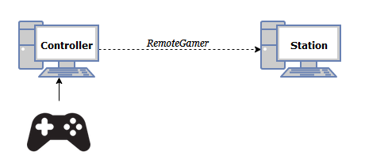

# RemoteGamer

To have a controller plugged into a remote machine.



## Roles

* `Controller`: I am the remote joystick. 
* `Station`: I have the game, I am the gaming station.

## Install

### I am the `Controller`

```bash
pip install -e .[controller]
```

### I am the `Station`

```bash
pip install -e .[station]
```

## How to use

### I am the `Controller`

```bash
$ # wait for Station to be up first, CAPTURE_IP is the ip of the Station
$ remotegamer remote --host=${CAPTURE_IP}
```

### I am the `Station`

```bash
$ remotegamer station
```

## Known bugs

* Xbox button check has false positives sometimes.

